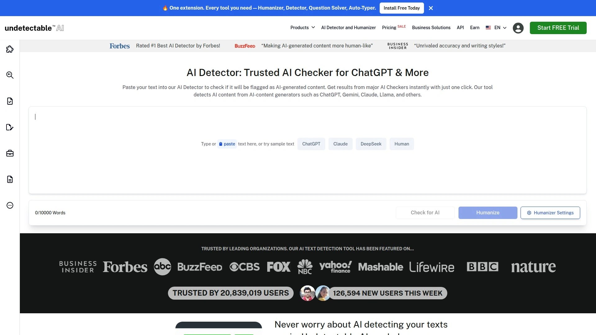
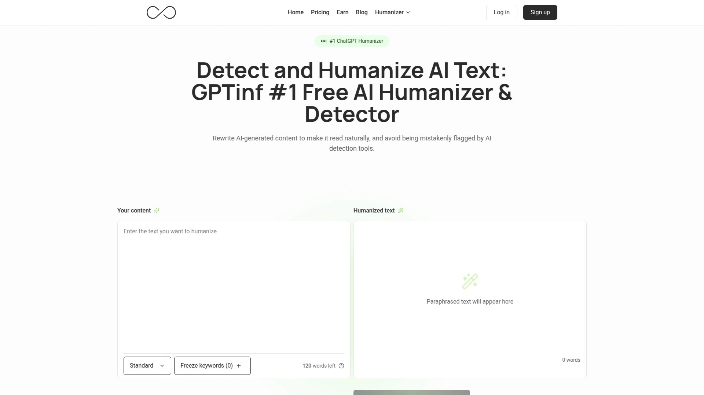
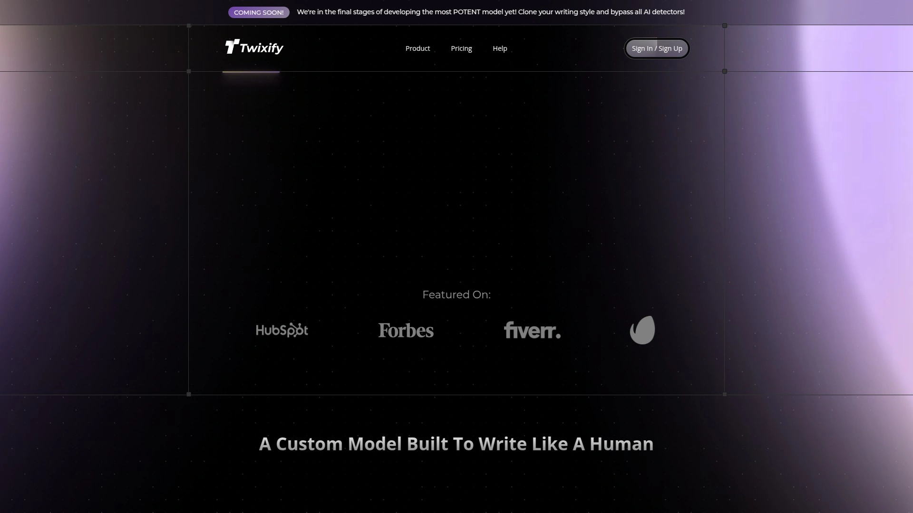

# Top 25 AI Humanizer Tools Ranked in 2025 (Latest Compilation)

AI-generated content can often sound **robotic and soulless**, leaving readers (and AI detectors) unimpressed. Whether you’re a student worried about Turnitin flags or a marketer aiming for authentic tone, *AI humanizer tools* are here to save the day. These platforms **rewrite and refine AI text** to make it sound genuinely human – improving readability, adding personality, and even bypassing AI detection checks. Let’s explore the top options in 2025 that can transform your ChatGPT drafts into natural, human-like writing while keeping those pesky detectors at bay.

## **[Walter Writes AI](https://walterwrites.ai)**
*One-click AI text humanizer & detector for authentic content.*

**Walter Writes AI** is an all-in-one platform to **humanize AI text and detect it** simultaneously. It’s trusted by millions across education, business, and content marketing for making AI content sound human. With Walter, you simply paste your AI-generated draft and hit *Humanize* – the tool then **rewrites the text in your own voice**, varying sentence structure and tone to eliminate that “ChatGPT feel.” It preserves your meaning and academic integrity while boosting the human-like flow. Walter even provides a built-in **AI detector** that shows a “human likelihood score” after rewriting, so you can verify the output is undetectable. There’s support for **80+ languages** and adjustable rewrite strength (from subtle to heavy rewrite) to suit your needs. The interface is user-friendly – *no technical skills required* – and they offer a **free trial for 300 words** to get you started. If you want a reliable, **all-purpose humanizer** to ensure your content passes Turnitin or GPTZero, Walter Writes AI is a top choice.

## **[Undetectable AI](https://undetectable.ai)**
*Specialized AI rewriter to bypass detectors and sound human.*

**Undetectable AI** is one of the most widely used AI detection **bypass and humanizing** tools today. It employs a sophisticated reformulation engine to rewrite your text just enough to avoid AI patterns, without ruining your content’s structure. The tool focuses on smoothing out tell-tale signs of AI writing – for example, it reduces overused punctuation and flattens the overly formal tone that AI often produces. The result is prose that flows naturally and **consistently passes AI checkers** (GPTZero, Turnitin, Originality.ai, etc.). Undetectable AI’s interface is straightforward: paste text, click a button, and it returns a humanized version. It’s popular among students and professionals for its **high success rate** and ease of use. Keep in mind the output can sometimes feel a bit *plain* or uniform, since it plays it safe with the rewriting. However, if your priority is **stealth** – avoiding detection above all – this tool lives up to its name. It offers a basic free tier (limited daily words) and competitive paid plans for heavier use. Overall, Undetectable AI is a go-to solution when you need quick, detection-proof rewrites without fuss.

## **[QuillBot](https://quillbot.com)**
*Popular AI paraphraser for natural-sounding rewrites.*

**QuillBot** is a well-known AI writing assistant used by over **4 million people worldwide**. While it wasn’t originally designed specifically to bypass AI detectors, QuillBot’s paraphrasing modes can definitely help make AI-written text read more naturally. You can paste up to 125 words at a time in the free version and choose from modes like *Standard* or *Fluency* to rephrase the content. The tool will then suggest a rewritten version that often uses simpler language and smoother phrasing, reducing the “robotic” feel of the original. QuillBot excels at preserving the **original meaning** while improving clarity. It’s great for simplifying complex sentences or adding a more conversational tone. The free plan is somewhat limited (e.g. fewer modes and shorter input length), but premium unlocks larger inputs and additional styles (like *Creative* or *Formal* mode). If you already use QuillBot for editing or plagiarism checking, it doubles as a handy **AI text humanizer**. Just run your ChatGPT draft through QuillBot’s rephraser and you’ll get a **more human-like version** that’s easier to read and less likely to trigger AI alarms. It’s a versatile, beginner-friendly tool that every AI-assisted writer should have in their arsenal.

## **[Writesonic](https://writesonic.com)**
*AI writing suite with a built-in “Humanize” rephrasing tool.*

**Writesonic** is a powerful AI content generator that also offers an **AI text humanizer** as part of its toolkit. Primarily known for creating blog posts and marketing copy, Writesonic ensures that the content you generate doesn’t sound robotic. In fact, one of its features explicitly helps **rewrite AI-generated passages into more human-like text**. The platform supports multiple formats (articles, ads, emails, etc.) and over 25 languages, giving it broad appeal for content creators. When you use Writesonic’s paraphrasing or text improver, it applies advanced AI to rearrange sentences, swap out awkward wording, and inject a more **conversational tone**. The advantage here is convenience – you can generate content with AI and immediately refine it *within the same interface*. Writesonic’s humanizer tends to keep a professional tone, just smoothing the edges for clarity. The output retains all your key points and facts but reads with improved **flow and readability**. For those already leveraging AI to draft content, Writesonic provides a seamless way to **polish it to human standards**. Pricing varies by usage, but there’s a free trial and reasonably priced plans for both casual and heavy users. It’s an excellent one-stop platform for creating, humanizing, and editing AI content.

## **[Monica AI](https://monica.im)**
*Versatile AI assistant with strong humanizing and analysis skills.*

**Monica AI** is an all-in-one AI assistant that not only chats and writes content, but also includes a robust **AI humanizer** feature. Monica leverages advanced models (like Claude 3 and GPT-4) to rewrite text in a way that passes even tough detectors like Originality.ai and Winston AI. In tests, Monica’s humanizer achieved a 100% human-written score on detector checks – an *outstanding* result. What sets Monica apart is its versatility: you can use it via a Chrome extension to humanize content on the fly, plus it can analyze PDFs, create images, and browse the web as a personal research assistant. Essentially, Monica can fit into various workflows, from polishing your essay to refining social media copy. It offers around **5,000 words free** (250 words per request) so you can try out its capabilities. The rewrites from Monica tend to maintain your original voice well, while fixing stiff wording and adding natural transitions. It’s particularly popular for marketing content – e.g. turning AI-written ad copy into something that **truly sounds human and engaging**. Do note that Monica’s full power comes at a premium cost (beyond the free trial), but users praise its high detector pass rate and **multifunctional toolkit**. If you want an AI buddy that can do it all – and make your AI text undetectable – Monica AI is worth a look.

## **[GPTinf](https://gptinf.com)**
*AI content rewriter with a novel approach (non-AI algorithm).*

**GPTinf** positions itself as a **next-gen alternative** to tools like Undetectable AI. Uniquely, GPTinf doesn’t use one AI to try to fix another – it runs on custom **non-AI algorithms** to paraphrase text in a human-like way. This means it preserves your content’s meaning and tone without introducing the odd quirks that AI-on-AI rewriting sometimes does. The result is consistently natural phrasing that reads as if a person wrote it. GPTinf gives you multiple rewriting modes: *Standard, Formal, Informal, Academic,* etc., so you can tailor the tone to your needs. It even has a handy “**freeze list**” feature – you can specify certain words or phrases to *not* change (great for keeping technical terms or keywords intact). In practice, you just paste your text and choose a mode; GPTinf quickly returns a rewritten version that often **flies under the radar of detectors**. For example, it’s tuned to beat Turnitin, GPTZero, Originality.ai, and more. There’s a free trial (a couple hundred words) to test it out, and paid plans with flexible options for students or teams. If you’re looking for cutting-edge tech that *consistently* bypasses AI checks while keeping your style, GPTinf is a strong contender. It’s fast, intuitive, and prides itself on producing **fluent, human-quality text** without the usual AI “fingerprints.”

## **[Humanize AI (Pro)](https://humanizeai.pro)**
*Free AI text converter with multiple tone modes.*

**Humanize AI Pro** is a **free online platform** dedicated to converting AI-generated text into 100% human-sounding writing. It’s a no-frills tool – just visit the site, paste your text, and it will generate a rewritten version aimed at being *undetectable* by AI checkers like GPTZero and Turnitin. Impressively, Humanize AI offers various rewriting modes (Simple, Formal, Informal, etc.), allowing you to choose how the tone should come out. For instance, you might use Formal for an academic paper, or Informal for a blog post. There’s even an “Ultra” mode which aggressively rewrites the text to ensure no detector will flag it (taking ~15 seconds to process). In tests, the tool significantly rephrases content – often swapping 50+ words and restructuring sentences for a more descriptive, **casual tone**. One cool aspect: it highlights the changes it made, so you can see exactly what was altered. Humanize AI Pro doesn’t have a built-in detector itself, but purely focuses on **rewriting**. The best part? You can use it for free up to **2,000 words** of content, which covers most essays and articles. It’s great for users on a budget who need an **effective AI-to-human text converter** without signing up. Just be aware that sometimes, if your input is already pretty decent, it might only tweak a few things – so results vary. Overall, Humanize AI is a generous free tool to make quick AI content touch-ups and ensure a more human flair in your writing.

## **[HumanizeAI.io](https://www.humanizeai.io)**
*Advanced AI text transformer boasting 99% undetectable rate.*

**HumanizeAI.io** is another dedicated humanizer that claims to turn AI text into content with a **99.5% success rate** of bypassing detectors. Aimed at writers who need completely *undetectable* output, HumanizeAI.io heavily reworks your input. In fact, it often performs a **high level of rewording** – swapping out dozens of words and significantly altering sentence structures. The result tends to be more formal and detailed; for example, it might add phrases like “cannot be distinguished from human authors” to emphasize natural style. It supports content from ChatGPT, Bard, etc., and ensures the final text “flows naturally like human content.” Using HumanizeAI.io is straightforward via their web interface. You might notice the tone of the rewritten text skews a bit academic or technical (as it adds formality) – which can be a plus or minus depending on your needs. **Core info is preserved**, so it won’t change facts or meaning, just the wording. This tool doesn’t include an AI detector tool, focusing purely on the transformation task. It often appeals to researchers and professionals who need to **sanitize AI-assisted drafts to meet high standards**. While the base usage is free (likely with a generous word limit), they may have premium options for bulk use. If you have a piece of AI writing that absolutely must *not* read like AI, HumanizeAI.io provides a thorough rewrite that comes out **polished and detector-safe**, albeit sometimes more formal than the original.

## **[HIX.AI (Bypass)](https://hix.ai)**
*Full-featured AI suite with a “HIX Bypass” humanizer tool.*

**HIX.AI** is an all-around AI writing platform (over 100 tools in one) that includes a specific feature called **HIX Bypass** to humanize AI-generated content. Essentially, if you’ve used HIX.AI to create text (or even if you haven’t), you can run the content through Bypass to **remove AI traits**. The output from HIX Bypass is quite impressive – it flows naturally and comes off very authentic, according to the company claims. In practice, HIX’s humanizer does a deep rewrite similar to other top tools: adjusting tone, varying sentence length, and replacing awkward wording. They emphasize that the rewritten content can pass the toughest detectors like Originality.ai and Sapling AI. One thing to note: the free trial for HIX Bypass is *fairly small* – you can only humanize about 80 words as a test, which gives you a taste but not much beyond a paragraph. For full documents, a paid plan is needed, and HIX is a bit on the pricier side. However, that price also gets you the whole HIX.AI ecosystem (grammar checks, translators, SEO tools, etc.). If you’re already using HIX.AI as your writing assistant, its **bypass tool** is a convenient add-on to ensure the text you produce is **undetectably human-like**. It’s like having an “AI-proofing” stage built into your workflow. For those who want a one-stop solution with robust features and don’t mind investing, HIX.AI’s humanizer is a solid component of a larger content creation suite.

## **[Surfer AI Humanizer](https://surferseo.com)**
*SEO-optimized content tool that now humanizes AI text.*

**Surfer** is famous as an SEO content optimization tool, and it has stepped into the AI arena with **Surfer AI** writing capabilities. One neat offering is the *Surfer AI Humanizer*, which integrates directly into Surfer’s platform. This means as you optimize your article for keywords and structure, you can also have Surfer AI tweak the language to be more **human-like and reader-friendly**. It’s a dual focus on **quality and SEO** – you won’t just rank well, your content will also *read* naturally. Surfer’s humanizer gives real-time feedback as you edit, suggesting changes that remove a robotic tone and improve the flow. For example, it might recommend more active voice, varied sentence lengths, or more engaging wording, all while keeping your target keywords intact for SEO. This is super helpful for marketers: you can start with an AI draft, optimize it with Surfer’s recommendations, and humanize the tone *in one go*. The integration means you don’t have to copy-paste between tools – it’s **built into your writing process** if you use Surfer’s editor. Surfer AI Humanizer likely requires a Surfer subscription (they were offering some AI credits or add-ons for content generation). Free access is restricted, possibly to trial versions of Surfer’s content editor. Overall, if you’re in content marketing or blogging, Surfer’s solution ensures **your content appeals to both search engines and human readers** – no monotone AI drivel here. It’s an efficient choice for SEO-driven writers who want an *edge in humanizing* their AI-assisted drafts.

## **[HyperWrite](https://hyperwriteai.com)**
*AI writing assistant that refines content to your style.*

**HyperWrite** is a popular AI writing assistant known for helping generate and improve text. While its primary use is to speed up writing, it inherently helps **humanize AI outputs** through its rewriting suggestions and personalization features. HyperWrite can analyze your writing and offer alternatives for sentences that sound off. For example, if you feed it a GPT-generated paragraph, HyperWrite might suggest more casual phrasing or break up a long sentence – changes that make the text feel more **natural and personal**. One cool thing about HyperWrite is it learns your preferred style over time. This means the more you use it, the better it can tweak AI content to **match your voice**. It functions across many platforms (there’s even a Chrome extension that can help rewrite text on any website). In terms of detection, content refined by HyperWrite tends to be less formulaic than straight AI output, which incidentally helps lower detection rates. It’s not marketed strictly as an “AI detector bypasser,” but users find it effective for **smoothing robotic text** in creative ways. HyperWrite’s interface feels like having a smart co-writer by your side: you can highlight a sentence and ask for rephrasing or tone adjustments. The suggestions are often spot-on for making the text sound **more human**, because it balances clarity with a touch of creativity. With free and pro plans, it’s accessible to students, professionals, and anyone who writes a lot. In short, HyperWrite is a great tool if you want ongoing AI-powered writing help that naturally **humanizes your content** as you go, without needing a separate “humanizer” step.

## **[BypassGPT](https://bypassgpt.ai)**
*Simple tool to rewrite content and slip past AI checkers.*

**BypassGPT** is designed for one job: **take AI-written text and make it “invisible” to AI detectors**. It’s a straightforward web tool where you drop in your text and it spits out a humanized version. Under the hood, BypassGPT supports over **50 languages** for rewriting, making it versatile for non-English content as well. The output generally has a more conversational tone – BypassGPT deliberately adds a bit of personality to avoid the flatness of AI prose. Many users like that it can inject a little *flair* into the writing (perhaps a blessing for dull content), but caution that it occasionally **overdoes it**. For instance, BypassGPT might introduce phrases or analogies that weren’t in the original text (this has been described as minor “hallucinations”). So while the content often becomes more lively and personable, you should proofread the result to ensure it hasn’t strayed off point. The trade-off is that this added color helps bypass detection by breaking up monotony. BypassGPT’s interface and process are very user-friendly – one click and done – with no need to adjust settings. They advertise it as perfect for writers, marketers, and professionals needing *human-sounding content fast*. It’s likely free to try with some limitations, and possibly offers a premium for unlimited use. In summary, BypassGPT is a **quick fix** tool: great for giving sterile AI text a quick personality boost and avoiding detector bots, as long as you double-check that the output still says exactly what you intend.

## **[StealthWriter](https://stealthwriter.ai)**
*Deep content rephrasing to fly under the radar.*

**StealthWriter** (often associated with the term “StealthGPT”) is a dedicated humanizer known for its **deep language transformation** approach. It doesn’t just swap words here and there – StealthWriter will restructure parts of your content and add various **connecting words and phrases** to make it read more fluidly. This gives the text a different rhythm than typical AI output, which is exactly what helps it evade detectors. Users have noted that StealthWriter’s changes can be more extensive than Undetectable AI’s, sometimes making the content even *more readable*. It might insert transitional phrases, diversify sentence lengths, or throw in colloquial terms to **mimic a human writing style**. That said, StealthWriter isn’t perfect: it’s been reported to occasionally introduce **grammatical mistakes or odd vocabulary choices**. So, you may need a quick proofread after using it, especially for professional documents. The output volume per run can be a bit limited too – it might process fewer words at a time compared to alternatives. On the positive side, it has shown strong results in avoiding detection by top AI checkers, with some tests citing over 90% bypass rates. The tool likely requires a subscription for full usage (with a **free demo** for small texts). If your goal is to **thoroughly humanize your writing**, even at the cost of minor edits afterward, StealthWriter is a powerful option that goes beyond superficial rephrasing. It truly attempts to **rewrite like a human**, making it valuable for high-stakes content.

## **[WriteHuman](https://writehuman.ai)**
*Browser-based AI humanizer with focus on tone.*

**WriteHuman** is a web-based AI rewriting tool built to convert AI text into something that “*feels like it came straight from a human*”. It’s quite straightforward: you paste your AI-generated content and WriteHuman will rephrase it, aiming to eliminate robotic tone and awkward phrasing. The strength of WriteHuman lies in its **affordability and accuracy** – it’s often praised as one of the more **accurate yet budget-friendly** humanizers out there. It effectively tones down the overly formal or repetitive patterns that AI outputs have, often making the text more **conversational and relaxed**. However, reviews mention a couple of caveats: the tool can sometimes produce slightly *awkward phrasings* itself that need a manual fix. In some cases, it might even add a little extra fluff or information in an attempt to humanize, which may or may not be desired. So, if you use WriteHuman, be ready to do a quick sanity check on the result. On the bright side, it definitely **removes the stiff, robotic vibe** from the writing – something users in forums have noted as a big plus. There’s even a built-in AI detector in their interface (in partnership with services like Copyleaks and ZeroGPT) so you can immediately see the “before and after” scores. WriteHuman typically offers a free trial and then a low-cost subscription. It’s ideal for students or bloggers who need an **easy, one-click humanizer** that gets the job done without breaking the bank. Just remember to proofread the output for any quirky sentences, and you’ll have human-like content ready to go.

## **[Humbot](https://humbot.io)**
*AI rewriter that softens tone (but double-check the output).*

**Humbot** is another AI humanizer tool, somewhat similar in approach to WriteHuman. Its goal is to **make your tone less robotic and more natural**. With a simple interface, Humbot will process your AI-written text and attempt to rewrite it in a more down-to-earth manner. It tends to add synonyms and occasionally re-order sentences. However, user tests and reviews have noted that Humbot can be a bit hit-or-miss. While it indeed might **dampen the obvious AI tone**, it has a tendency to add *irrelevant bits* or make odd formatting choices (like strange capitalization or spaces). The structure of the output sometimes still **feels somewhat robotic** too – meaning it may not be as advanced in restructuring as some top-tier tools. In terms of AI detector bypass, Humbot has struggled; it is **less likely to fully fool detectors** compared to others. Essentially, it might reduce your AI content’s detectability a bit, but probably not enough on its own for the toughest checks. The upside is that Humbot is easy to use and might be improving over time. It could be useful for a quick first pass to *“de-bot”* your text’s tone, after which you manually clean up any issues. It’s often free or low-cost, making it accessible if you want to experiment. The bottom line: consider Humbot a **basic humanizer** – it will make your text sound more casual and human-like, but you’ll want to double-check and edit the output to ensure it’s polished and truly detector-safe.

## **[Ahrefs AI Text Humanizer](https://ahrefs.com/ai-content-humanizer)**
*Free utility from Ahrefs to smooth out AI drafts.*

**Ahrefs**, a big name in SEO tools, offers a **Free AI Text Humanizer** on their website. This tool is a nifty add-on Ahrefs created (likely as a teaser for their capabilities) that quickly turns AI-generated text into something more human-readable. It’s great for things like blog snippets, social media captions, emails, and more. Since it’s free, you don’t even need an account – you can just paste your text and get a result. In testing, Ahrefs’ humanizer made **moderate adjustments** to the text. It might swap around 30-40 words in a piece of a few hundred, focusing on little tweaks rather than complete rewrites. Think of it as a light touch-up: it will smooth some phrasing (e.g. changing “effortlessly converts” to “seamlessly transforms”), add a bit of flow, and maybe simplify a technical term into plain language. The **clarity and tone** tend to remain professional and polished – Ahrefs’ tool won’t drastically alter your style, which is good if you just want a gentle humanizing effect. It also preserves all original facts and meaning, so no risk of it introducing inaccuracies. The only downside is its limitation (there might be a character cap per use) and the lack of multiple modes – it’s a one-size-fits-most approach. But hey, it’s free! If you need a quick way to **smooth out AI content** without any commitment, Ahrefs AI Humanizer is worth a try. It’s especially handy if you’re already on the Ahrefs site doing SEO work and want to clean up an AI-written paragraph on the fly.

## **[Humanizer.org](https://humanizer.org)**
*Free no-signup tool to make AI text undetectable.*

**Humanizer.org** is a simple, no-frills **free AI humanizer** – no login required. It’s designed to help anyone (students, bloggers, etc.) take an AI-written piece and **turn it into human-like content** that won’t be flagged by detectors. The tool is straightforward: paste your text and it outputs a rewritten version. Notably, Humanizer.org specifically mentions supporting essays, articles, and other long-form writing, with the goal of passing checks like Turnitin, GPTZero, and Originality.ai. In practice, Humanizer.org’s algorithm tends to do heavy restructuring – it often performs a **high level of rewording (60+ words changed)** in a paragraph, and simplifies complex sentences into shorter, more casual ones. The tone of the output can come across as *informal and energetic*, sometimes even a bit too casual or promotional in flavor. For example, it might insert a phrase like “Tired of boring AI text? We fix that…” which adds pep but could sound out of place in a formal context. It also might accidentally introduce small typos (one test saw “AI” mistakenly turned into “Al”), so keep an eye out for that. Essentially, Humanizer.org trades a bit of professionalism for a more **relatable, human tone**. It’s excellent if your AI content feels dry – this will inject life into it – but if you need a polished academic tone, you might need to refine the output. Since it’s free, it’s a fantastic tool to experiment with: you can always tone down the result manually. In summary, Humanizer.org is a quick and **accessible way to “humanize” your text**; just be ready to do minor edits if it gets *too* human (with slang or hype) for your liking.

## **[AIHumanizer](https://aihumanizer.ai)**
*100% free AI humanizer with no login (by CleverFiles).*

**AIHumanizer** is a recently launched tool (by the folks at CleverFiles) that promises to **rewrite AI content into undetectable, human-sounding text**. It’s **completely free to use**, making it an attractive choice for students and writers on a budget. With AIHumanizer, you just paste your AI-written content and hit a button – there’s no registration barrier. The tool’s algorithm focuses on altering sentence structures and word choices enough to evade AI detection, while **enhancing readability and engagement**. It’s multilingual and works on pretty much any type of text. Early users report that it does a solid job smoothing out the robotic tone and adding a bit of human-like style (like varying vocabulary and sentence length). Since it’s newly released (circa late 2025), it’s likely incorporating up-to-date techniques to beat current detectors. One cool aspect: because it’s free and unlimited, you can run your text through AIHumanizer multiple times or in chunks if needed. The output quality is generally high for a free tool – content comes out more natural and less repetitive. However, as with any free service, be mindful of potentially heavy server load or slower processing times if it gets popular. Also, given it’s new, there may be tweaks ongoing to improve its performance. Overall, AIHumanizer is a **no-cost lifesaver** for quickly humanizing AI text. It lowers the barrier for anyone to ensure their content **sounds original and passes detector tests**, without spending a dime.

## **[AskYourPDF (AI Humanizer)](https://askyourpdf.com)**
*AI assistant that can humanize text for relatable communication.*

**AskYourPDF** is known as a tool to chat with and extract info from PDFs, but it also offers a handy **AI humanizer function**. This feature is somewhat hidden in its suite, but it’s powerful: it instantly transforms AI-generated text into **natural, relatable content**. The idea is to combine intelligent AI rewriting with a “human touch” so the end result resonates with readers. For example, AskYourPDF’s humanizer will simplify complex AI-speak, use more direct language, and ensure the tone is engaging rather than monotone. One test noted it made about 50 word swaps and shortened some sentences, making the text more *straightforward* and casual. The output was approachable – as if written by a person – though occasionally a phrase might come out slightly awkward or repetitive (e.g., it overused the word “unique” in one instance). This tool is quite useful for educators, marketers, or anyone who used an AI to draft content and now needs it to **sound human for an audience**. Because it’s part of AskYourPDF, the interface is user-friendly: you can likely upload a document or paste text and then click a “Humanize” option. It’s a convenient all-in-one if you were already analyzing a PDF and then want to humanize some extracted summary, for instance. As for cost, AskYourPDF has free basic usage, so you might be able to use the humanizer without premium, depending on the word count. In summary, AskYourPDF’s humanizer is a nice **value-add tool** – it ensures your AI-written materials communicate clearly and **connect with readers**, with minimal effort on your part.

## **[Twixify](https://twixify.com)**
*Style-matching humanizer that adapts to your writing voice.*

**Twixify** takes a unique approach to AI humanizing: instead of just generic rewrites, it focuses on **style adaptation and personalization**. Essentially, Twixify allows you to feed it samples of your own writing so it can learn your habits – your tone, favorite words, punctuation style, etc. – and then **rewrites AI content to match that style**. The result is AI-generated text that doesn’t just sound human, it sounds like *you*. This is incredibly useful for content creators who have a distinct voice (like bloggers or social media influencers). Once Twixify has a read on your style, it produces a mimicked version of the AI text with a spontaneous and personalized structure. Users report that Twixify is great at removing the stiff “AI rhythm” and injecting the quirks that make writing feel authentic. It’s also **free and no-login required** at the moment, which is a bonus for quick usage. However, Twixify isn’t solely built to bypass detectors, so extremely advanced AI checkers might still catch patterns if your personal style itself isn’t super varied. Its core strength is **enhancing the natural feel** and ensuring the content reads as if you wrote it from scratch. Also, a caution: because it heavily personalizes output, if you don’t provide enough sample text or if your own writing is very formal, it may not drastically change the AI-ness of a text. But for most, it does wonders in making content “sound like me.” Twixify is an innovative choice when consistency in voice matters – your audience won’t suspect a robot behind the words.

## **[Uncheck AI](https://uncheck.ai)**
*AI checker and humanizer combo to keep content human.*

**Uncheck AI** doubles as both an AI detector and a humanizer tool. Its claim to fame is helping users **create undetectable AI content** by first checking for AI signals and then rewriting the text to remove them. With Uncheck, you can paste text and get an analysis of how “AI-like” it is, and then use their rewrite function to humanize it. The humanizer part offers a few approaches – for example, you might choose to replace words, restructure sentences, or use something they call “AI marker suppression”. These options give you some control over how the content is transformed. Uncheck’s rewrites are generally conservative: some users found it makes only **very minor changes** if the text isn’t flagrantly AI-sounding. That means the output might still feel a bit mechanical if the input was very AI-ish, because the tool errs on the side of small tweaks. On one hand, this is good for preserving your original style and meaning (it’s not going to add weird stuff), but on the other hand, the final result can sometimes **still be flagged by detectors** because not enough changed. Essentially, Uncheck AI is a nice *safety check*: it can highlight problems and do light humanization, but it may not fully “launder” the text to 100% human form on its own. It’s easy to use and likely free for basic usage, which makes it a handy tool to run your content through. If Uncheck’s humanizer doesn’t satisfy, at least its detector will tell you if you need to try a more aggressive tool. In short, use Uncheck AI if you want a quick **AI-content audit and a gentle rewrite**, keeping in mind you might need a second pass with another solution for tough cases.

## **[Hypotenuse AI](https://hypotenuse.ai)**
*AI writing platform known for human-like marketing copy.*

**Hypotenuse AI** is an AI content generation platform tailored for e-commerce and marketing, but it’s often mentioned as an alternative approach to getting **undetectable content**. Hypotenuse’s strength is that it generates copy – like product descriptions, ads, or blog sections – with a very **natural tone and SEO optimization**. Because it’s focused on quality marketing content, the text it produces tends to already be **engaging and human-like**, minimizing the need for heavy rewriting. Many users find that Hypotenuse’s output, especially in informal or creative modes, passes AI detectors more easily than vanilla GPT outputs, simply due to its writing style. Essentially, it’s like using a “smarter” AI that writes in a more varied and less robotic manner. The platform also includes editing features where you can instruct it to rewrite certain sentences or change the tone, which can serve as built-in humanization. For example, if a line feels too stiff, you can ask Hypotenuse to make it more casual or witty. It employs its own models and possibly fine-tuned algorithms to keep the content **reader-friendly and on-brand**. While Hypotenuse AI isn’t a free tool (it’s a paid service with trial credits), it can be a great solution if you want to *avoid the problem altogether* by having your content come out human-sounding from the start. It’s especially useful for businesses that need lots of product or marketing content: you feed in some details and get back well-written text that often **requires minimal humanization**. In sum, Hypotenuse AI is like having a copywriter AI that naturally **avoids the usual AI giveaways**, providing publish-ready content with less editing needed for human touch.

## **[Wordtune](https://wordtune.com)**
*AI-powered rewriter that fine-tunes tone and clarity.*

**Wordtune** is a popular AI writing companion developed by AI21 Labs (the team behind the advanced AI model Jurassic). It’s essentially an **intelligent rephrasing tool** – you highlight a sentence or paragraph, and Wordtune offers several reworded versions to choose from. This makes it excellent for **humanizing AI text** because you can pick the suggestion that sounds most natural or aligned with your voice. Wordtune excels at improving clarity and flow: it can shorten overly verbose AI sentences or expand choppy ones for better context. It also has tone options (casual or formal) to match the vibe you need. For instance, if an AI output is too stiff, a casual rewrite from Wordtune might throw in a contraction or a simpler phrase that instantly **feels more human**. One limitation is the free version of Wordtune only supports rewriting a sentence or two at a time (there’s a character limit) – which can be tedious for long texts. The premium allows longer rewrites and a richer set of suggestions. While Wordtune isn’t explicitly marketed as an AI detector bypass, many people use it to polish ChatGPT drafts. It’s quick to use (even has a Chrome extension that works in Google Docs, etc.), and the results keep the **original meaning intact** while usually making the language more **colloquial and lively**. Think of it as having an editor friend look over your AI-written stuff and say “hey, this would sound better like this.” It won’t drastically change content or inject randomness, so your text remains coherent – just **better-worded and more reader-friendly**. If you’re dealing with shorter snippets or are willing to iterate through your document, Wordtune is a solid pick to gradually transform robotic phrasing into human-approved prose.

## **[Semihuman.ai](https://semihuman.ai)**
*Lightweight humanizer focusing on authenticity.*

**Semihuman.ai** is a tool that, as the name implies, takes AI text and makes it “semi-human” – or ideally fully human in impression. It specializes in maintaining **content authenticity with a straightforward interface and effective humanization**. This means the tool tries not to overdo the changes; it preserves the core message and structure where possible, while fixing the elements that make the text sound artificial. Semihuman.ai tends to keep sentences clear and concise, avoiding the overly complex constructs AIs sometimes use. It’s particularly good for ensuring the text remains **readable and genuine** – basically, it won’t introduce any weird slang or jokes unless your context calls for it. The interface is very simple: likely a single-page where you paste text and get a result, making it accessible to anyone. One downside noted in comparisons is that Semihuman.ai offers **limited free usage** – perhaps a small daily or monthly quota. This suggests it’s a freemium model: enough to test or do occasional fixes, but heavy users would need to subscribe. In terms of output, Semihuman’s changes might seem subtle at times, which is actually a plus if you just need a gentle human touch without drastic rewriting. It’s a bit like having a human editor smooth out the edges rather than rewrite your whole paragraph. The result should pass most casual inspections as human-written, though for the most advanced AI detectors, Semihuman might not always be aggressive enough. In short, Semihuman.ai is great if you want to maintain **your original writing style** and just enhance its human quality slightly. It’s quick, easy, and keeps things authentic – a handy tool for light humanization tasks.

## **[WriteHybrid](https://writehybrid.com)**
*Professional-grade humanizer touting full detector bypass.*

  

**WriteHybrid** is an **AI humanizer tool** that markets itself as being able to *bypass every AI detector* out there. A bold claim, but they back it with a focused approach: their advanced rewriting algorithm transforms AI content into **natural, human-sounding text** while maintaining the original quality and readability. It’s aimed at professionals – their site shows a strong endorsement with thousands of users and high ratings, indicating it’s a trusted solution for many. Using WriteHybrid is as simple as any: paste your content (up to 500 words at a time for the free tier, as they give 500 free words monthly) and let it process. The output is tuned to be **undetectable by all major tools** – they specifically list GPTZero, Turnitin, Originality.ai, Copyleaks, and more, showing “Bypassed” for each. In other words, WriteHybrid optimizes the rewrite to not trigger the red flags those detectors look for. It tends to vary sentence structures significantly and substitute synonyms smartly, all while keeping the text coherent and **super readable**. The nice thing is it doesn’t dumb down the content; WriteHybrid’s results usually still *sound like you*, just a bit more **polished and varied** in expression. It preserves tone and intent well, thanks to not relying solely on AI but presumably a combination of rules and AI. There’s an emphasis on *maintaining superior quality* – so unlike some tools that may break the flow, WriteHybrid’s output reads fluently as if a skilled writer edited it. They offer this as a web app and possibly as a desktop app too, indicating a mature product. For serious use (like publishing content or academic submissions), WriteHybrid is a top-tier choice. It effectively **outsmarts detectors** and delivers high-quality rewrites you can confidently use with minimal to no additional editing. If you’re frequently in need of humanizing large volumes of text, investing in WriteHybrid could save you a lot of time and worry.

---

## ❓ FAQ: Common Questions About AI Humanizer Tools

**Q1: How do AI humanizer tools actually work to avoid detection?**
**A1:** They use advanced algorithms to rewrite text on multiple levels – changing words, reordering sentences, and adjusting tone. By mimicking human writing patterns (e.g. varying sentence length, using more natural phrasing), they remove the statistical markers that AI detectors look for. Essentially, they make the content **flow like human writing**, so detectors have little to grab onto.

**Q2: Will using an AI humanizer preserve my original meaning and voice?**
**A2:** Generally yes. Good humanizers (like the ones listed) focus on *how* things are said, not *what* is said. They keep your key points and facts intact, just expressed more naturally. Some even let you lock certain phrases or mimic your style to be safe. It’s wise to review the output though, to ensure it still conveys your intent – especially if the tool did a heavy rewrite.

**Q3: Do I need any technical skills to use these tools?**
**A3:** Not at all. These platforms are made for everyday users. Typically, you **copy-paste your text and click a “Humanize” or “Rewrite” button**, and the tool does the rest. The interfaces are user-friendly, often with options to choose tone or intensity, but no coding or technical know-how is required. If you can use a web browser, you can use an AI humanizer.

**Q4: Is the content 100% safe from AI detectors after using these tools?**
**A4:** While many tools boast high success rates (90%+), no method is **guaranteed** forever. Detectors are constantly evolving. These tools greatly *lower* the chance of detection – often to effectively zero for current checkers – but there’s always a small risk if detectors get more sophisticated. Your best bet is to also write in some of your own tweaks for important work, and use multiple detectors to check. In practice, content run through reputable humanizers very rarely gets flagged under today’s detection algorithms.

**Q5: Which tool should I use if I’m a student vs. a business user?**
**A5:** For students on a budget, free tools like **Humanize AI Pro** or **AIHumanizer** are great starting points, and **Walter Writes AI** offers a free trial that covers an essay. These will help you pass Turnitin without costing a dime. For business or heavy use, a premium solution like **WriteHybrid** or **Undetectable AI** can save time with more consistent results and support. If style consistency is important (say for brand voice), a tool like **Twixify** or an assistant like **HyperWrite** that adapts to you would be beneficial. Essentially, students should leverage free allowances and simplicity, while professionals might invest in the tool that best integrates with their workflow (SEO folks might pick Surfer, marketers might go with Hypotenuse or Writesonic, etc.).

---

## **Conclusion & CTA**

In a world where AI-written text is everywhere, these **AI humanizer tools** are the secret weapon to keep your content engaging and undetectable. They ensure you get the **efficiency of AI** without the tell-tale robotic tone, so you can confidently use AI for drafts and still sound like *your authentic human self*. We’ve covered options from free quick fixes to full-fledged professional suites – so there’s something here for every need and budget. Remember, the goal isn’t just to *trick detectors*, but to create content that **truly resonates with readers**. The difference is night and day once you humanize your text! If you’re ready to transform your AI content, give our #1 pick – **[Walter Writes AI](https://walterwrites.ai)** – a try. It’s the top choice for seamlessly turning any robotic draft into natural, audience-ready writing, making it perfect for students, marketers, and professionals alike. With the right tool in hand, you can enjoy the best of AI assistance *and* genuine human touch in every piece you write. Happy writing!
